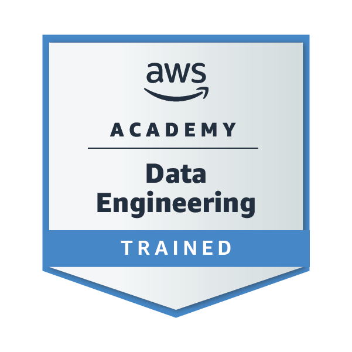

<h1 align="center">Hi, I'm Kittipop 👋</h1>

  <b>Computer Engineering Student · Khon Kaen University, Thailand</b> 
  Software &nbsp; / &nbsp; Hardware &nbsp; / &nbsp; Design &nbsp; / &nbsp; Automation

 

### About me

I enjoy solving problems across **software, hardware, and design**, bringing different parts together to build practical systems. I'm always curious about new technologies and ways to make things work better.

- **Software & computing:** programming, databases, and networking.
- **Hardware & integration:** electronics, embedded systems, and connecting hardware with software.
- **Design & prototyping:** circuit design, mechanical design, and turning ideas into physical prototypes.
- Interested in **automation, robotics, and improving how systems work together**.

 

---

## Languages & tools

A selection of the languages, platforms, and tools I use across my work.

#### Programming

  

C &nbsp; · &nbsp; C++ &nbsp; · &nbsp; Python &nbsp; · &nbsp; Java

#### Hardware platforms

  
  
  

#### Design & prototyping

  
  
  

#### Development tools

  

Git &nbsp; · &nbsp; MySQL &nbsp; · &nbsp; VS Code &nbsp; · &nbsp; Arduino IDE

---

## Training & credentials

**AWS Academy Graduate - Data Engineering - Training Badge**

Completed 40 hours of training.

[View digital badge on Credly](https://www.credly.com/go/XGZy7YIA)

---

### Connect with me

  
  

